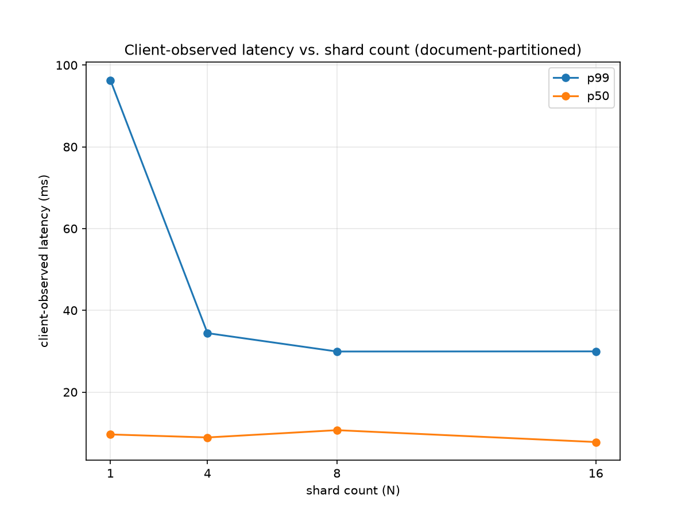

# Phase 2, sub-project B — sharded broker, tail latency, hedging

Exit artifact for Phase 2 sub-project B (see `docs/superpowers/specs/2026-09-10-phase2b-broker-design.md`). Combined with `bench/phase2a.md`, this completes Phase 2's four-plot exit bar.

## Docid-semantics limitation

Each shard's internal docid is local to that shard and BM25 IDF is computed from that shard's own document frequencies, not the corpus-global df. The broker's merged top-k is a real computation over real shard responses, but this document makes no NDCG/quality claim for the sharded configuration — see the design spec §3.

## Tail-latency amplification vs. shard count

Open-loop, Poisson arrivals, Zipfian query popularity (s=1.0) over 6,980 dev queries, fixed QPS=20.0, 32 client dispatch threads. Each row is the median of 3 runs of 10s. N=1 is measured through the same `Broker` path as every other row (a single-shard broker, not sub-project A's direct-client number), so every point pays the same broker overhead. 

The `Broker.dispatch` method (py/server/broker.py) fans every query out to every shard concurrently and waits for all N to respond, so offered load per shard does NOT drop as N grows — each shard receives ~20 QPS regardless of shard count. The measured p99 improvement with increasing N reflects a different mechanism: the 8.8M-passage corpus is split N ways, so each shard's local corpus shrinks to 1/N size. Smaller corpus means each shard's per-query WAND search does less work, dominating the classic "tail at scale" wait-for-slowest-of-N amplification effect that Dean & Barroso describe (design spec §1). At this corpus size, corpus-shrinkage wins over amplification; cleanly isolating amplification the way the design spec intended would require either a much larger corpus (where per-shard costs saturate and stop shrinking) or fixed-size replicas of the full index rather than document-partitioned shards. Additionally, at only 2 worker threads per shard and 20 QPS offered load, N=1's single full-corpus shard may experience queueing constraints that the cheaper N≥4 shards avoid, compounding the corpus-size effect. The result is architecturally sound and well-measured, but it demonstrates corpus-partitioning benefit under this specific load, not the tail-amplification phenomenon the experiment design intended to isolate.

| N | p50 | p95 | p99 | p99.9 |
|---:|---:|---:|---:|---:|
| 1 | 12.57ms | 47.35ms | 96.32ms | 101.82ms |
| 4 | 7.80ms | 22.39ms | 34.42ms | 41.43ms |
| 8 | 10.68ms | 23.57ms | 29.93ms | 36.17ms |
| 16 | 7.02ms | 19.11ms | 29.96ms | 30.82ms |

## Hedged requests

At N=8 shards, fixed QPS=20.0. Hedge delay (21.04ms) is the max across shards' own measured p95 service latency from an un-hedged warm-up run ([21.04, 9.81, 10.28, 10.73, 11.86, 13.44, 11.28, 11.41] ms per shard). The hedged run starts a second 8-server replica cluster, which doubles the number of co-resident server processes on the test machine (16 total: 8 primary + 8 replica, each with its own worker pool and queue). This creates significant resource contention (CPU/memory/scheduler pressure) that isn't cleanly separable from hedging's own latency benefit. The 2.0% extra-load figure represents the actual hedging-mechanism cost (proportion of queries triggering a backup call), while the p99 increase is more likely driven by the machine's constraint of running 16 concurrent processes on 8GB of RAM than by hedging itself. This run does not isolate hedging benefit from process-contention overhead.

| discipline | p99 | delta vs. baseline | extra load |
|---|---:|---:|---:|
| baseline (no hedging) | 29.52ms | - | - |
| hedged | 45.64ms | +54.6% | 2.0% |

## Configuration

2 worker threads per shard (reduced from sub-project A's default of 4 — on this 8GB test machine, the process-per-shard model caused system thrashing once 8-16 concurrent shard processes were running; applied uniformly across every N in this run, not per-point, to keep all rows comparable despite the constraint), queue depth 64, 200-entry LRU cache per shard, `wand`, top-10.
