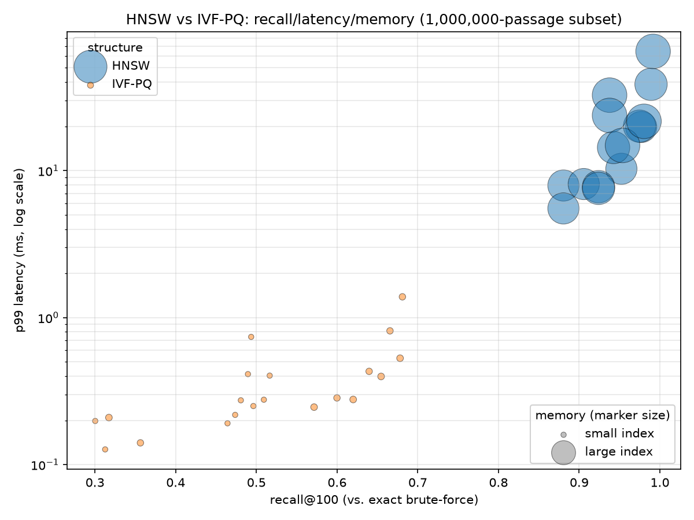

# Phase 3: Dense Recall and the ANN Pareto Frontier

## Corpus subset (limitation, stated up front)

This machine has 8GB RAM and no GPU. The full 8.8M-passage corpus would need
~13.5GB just for float32 embeddings before any index overhead, so this phase
subsets to **1,000,000 passages**: every document judged in the
dl19+dl20 qrels, plus a seeded random fill. The Pareto-frontier finding (which
ANN structure wins at which recall target) does not depend on corpus size;
only the absolute latency/memory numbers would shift at 8.8M. This does *not*
extend to the fusion table below: there, the lexical channel searches the
full 8.8M-passage corpus (Phase 1's WAND run) while the dense channel only
searches this 1M-passage subset, so `dense_only` vs. `lexical_only` NDCG@10 is
not a like-for-like comparison of the two retrieval methods -- it's partly an
artifact of the dense channel's much smaller, guaranteed-relevant-doc haystack.

Encoder: `BAAI/bge-small-en-v1.5`. Evaluated over 6980
dev queries (recall@100 / latency) and dl19+dl20 (fusion table).

## Pareto frontier: recall@100 vs. p99 latency

| structure | config | recall@100 | p50 (ms) | p99 (ms) | memory (GB) |
|---|---|---|---|---|---|
| hnsw | M=64 efSearch=512 | 0.9916 | 7.98 | 64.72 | 2.068 |
| hnsw | M=32 efSearch=512 | 0.9890 | 4.75 | 38.66 | 1.812 |
| hnsw | M=64 efSearch=256 | 0.9803 | 3.08 | 21.65 | 2.068 |
| hnsw | M=16 efSearch=512 | 0.9768 | 3.10 | 19.81 | 1.685 |
| hnsw | M=32 efSearch=256 | 0.9748 | 2.62 | 20.06 | 1.812 |
| hnsw | M=64 efSearch=128 | 0.9537 | 2.06 | 14.83 | 2.068 |
| hnsw | M=16 efSearch=256 | 0.9523 | 1.79 | 10.29 | 1.685 |
| hnsw | M=32 efSearch=128 | 0.9426 | 1.55 | 14.36 | 1.812 |
| hnsw | M=64 efSearch=32 | 0.9377 | 4.95 | 32.62 | 2.068 |
| hnsw | M=64 efSearch=64 | 0.9377 | 2.52 | 23.74 | 2.068 |
| hnsw | M=32 efSearch=32 | 0.9240 | 1.21 | 7.77 | 1.812 |
| hnsw | M=32 efSearch=64 | 0.9240 | 1.27 | 7.57 | 1.812 |
| hnsw | M=16 efSearch=128 | 0.9057 | 0.97 | 8.10 | 1.685 |
| hnsw | M=16 efSearch=32 | 0.8805 | 0.82 | 7.92 | 1.685 |
| hnsw | M=16 efSearch=64 | 0.8805 | 0.79 | 5.53 | 1.685 |
| ivfpq | nlist=1024 m=64 nprobe=64 | 0.6810 | 1.19 | 1.38 | 0.074 |
| ivfpq | nlist=4096 m=64 nprobe=64 | 0.6781 | 0.44 | 0.53 | 0.079 |
| ivfpq | nlist=1024 m=64 nprobe=32 | 0.6656 | 0.58 | 0.81 | 0.074 |
| ivfpq | nlist=4096 m=64 nprobe=32 | 0.6546 | 0.31 | 0.40 | 0.079 |
| ivfpq | nlist=1024 m=64 nprobe=16 | 0.6397 | 0.34 | 0.43 | 0.074 |
| ivfpq | nlist=4096 m=64 nprobe=16 | 0.6199 | 0.24 | 0.28 | 0.079 |
| ivfpq | nlist=1024 m=64 nprobe=8 | 0.5999 | 0.22 | 0.28 | 0.074 |
| ivfpq | nlist=4096 m=64 nprobe=8 | 0.5715 | 0.21 | 0.25 | 0.079 |
| ivfpq | nlist=4096 m=32 nprobe=64 | 0.5165 | 0.32 | 0.40 | 0.047 |
| ivfpq | nlist=4096 m=32 nprobe=32 | 0.5093 | 0.24 | 0.28 | 0.047 |
| ivfpq | nlist=4096 m=32 nprobe=16 | 0.4963 | 0.21 | 0.25 | 0.047 |
| ivfpq | nlist=1024 m=32 nprobe=64 | 0.4936 | 0.60 | 0.74 | 0.042 |
| ivfpq | nlist=1024 m=32 nprobe=32 | 0.4896 | 0.35 | 0.41 | 0.042 |
| ivfpq | nlist=1024 m=32 nprobe=16 | 0.4807 | 0.22 | 0.27 | 0.042 |
| ivfpq | nlist=4096 m=32 nprobe=8 | 0.4737 | 0.19 | 0.22 | 0.047 |
| ivfpq | nlist=1024 m=32 nprobe=8 | 0.4642 | 0.15 | 0.19 | 0.042 |
| ivfpq | nlist=1024 m=64 nprobe=1 | 0.3563 | 0.11 | 0.14 | 0.074 |
| ivfpq | nlist=4096 m=64 nprobe=1 | 0.3173 | 0.18 | 0.21 | 0.079 |
| ivfpq | nlist=1024 m=32 nprobe=1 | 0.3126 | 0.09 | 0.13 | 0.042 |
| ivfpq | nlist=4096 m=32 nprobe=1 | 0.3003 | 0.17 | 0.20 | 0.047 |

HNSW's efSearch=32 and efSearch=64 rows show byte-identical recall@100 at
every M: hnswlib internally clamps effective ef to at least k (100), so both
nominal values run the same effective search. The p99 latency differences
between those two rows are measurement noise, not signal.

## Hybrid fusion (dl19+dl20)

| channel | NDCG@10 | recall@1000 |
|---|---|---|
| lexical_only | 0.4903 | 0.7716 |
| dense_only | 0.7167 | 0.9070 |
| rrf | 0.6414 | 0.9245 |
| score_fusion | 0.6577 | 0.9216 |

Equal-weight RRF and score fusion both land between `lexical_only` and
`dense_only` on NDCG@10 -- below `dense_only`, since fusion dilutes the
stronger (but corpus-asymmetric, see above) dense channel with the weaker
lexical one -- while gaining a bit over both on recall@1000, since fusing
unions two largely disjoint document sets, which mechanically raises recall
regardless of ranking quality.

## Configuration

- subset seed: 0
- device: mps
- git SHA: `009e697299cc3fedf1a929b681416e7db1543537`
- hardware: Apple M2, 8GB RAM
- timestamp: 2026-08-20T12:17:46.406014+00:00
- note: the sweep, fusion, and memory-remeasurement runs that produced this
  report's data were all against a dirty working tree (`git_dirty: true` in
  each result JSON's own provenance block)
