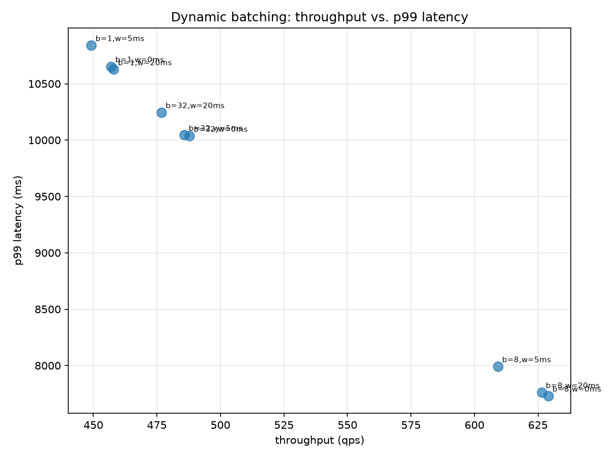

# Phase 4: Ranking Cascade and Heterogeneous Serving

## Execution provider check

All sub-experiments ran on `CUDAExecutionProvider` as requested.

## Candidate pool (limitation, stated up front)

The pre-rank/rank cascade runs over Phase 1's existing lexical WAND
candidates (depth 1000, full 8.8M-passage corpus) — not fused with Phase 3's
dense recall channel. Dense score is used only as a pre-rank *feature*, not
as a separate recall channel.

## Prerank-consistency

Of the true top-100 under the full cross-encoder
ranker, **64.5%** survive pre-ranking
(mean over 97 dl19+dl20 queries). Full-cascade result:
NDCG@10 = 0.7394, recall@100 = 0.6299.
Phase 1's own first-stage (lexical-only) baseline over the same
97 queries: NDCG@10 = 0.4903.

## Dynamic batching: throughput vs. p99 latency

| max_batch_size | max_wait_ms | throughput (qps) | p50 (ms) | p99 (ms) |
|---|---|---|---|---|
| 8 | 0 | 629.0 | 3933.39 | 7731.29 |
| 8 | 20 | 626.4 | 3919.26 | 7762.51 |
| 8 | 5 | 609.2 | 4162.25 | 7992.00 |
| 32 | 0 | 487.8 | 5156.86 | 10036.10 |
| 32 | 5 | 485.9 | 5112.87 | 10045.13 |
| 32 | 20 | 476.8 | 5309.10 | 10246.02 |
| 1 | 20 | 458.0 | 5382.33 | 10626.72 |
| 1 | 0 | 456.9 | 5408.21 | 10653.22 |
| 1 | 5 | 449.2 | 5623.65 | 10841.14 |

*Each row is a saturating probe (a fixed request budget drained as fast as the config allows), not a fixed client arrival rate -- latency here is drain-dominated and only comparable config-to-config at equal budget, not an absolute client-side number. The queue-discipline table below offers a real specified arrival rate, where latency is absolute.*

## Precision comparison (at the best-throughput batching setting)

| precision | throughput (qps) | p99 (ms) | p999 (ms) | max (ms) | cascade NDCG@10 | delta vs. fp32 |
|---|---|---|---|---|---|---|
| fp32 | 623.3 | 7803.83 | 7873.08 | 7873.29 | 0.7394 | +0.0000 |
| fp16 | 1352.9 | 3571.93 | 3598.69 | 3600.52 | 0.7393 | -0.0000 |
| int8 | 65.7 | 74578.57 | 75082.65 | 75105.01 | 0.7374 | -0.0020 |

*throughput/NDCG columns are the real cross-precision comparison. The latency columns are saturating-probe numbers (see the batching table above) -- a slower precision drains the same request budget over a longer wall clock, so its p99/p999/max inflate roughly in proportion to its slowness, as an artifact of the probe rather than of serving latency at a fixed rate. Each precision's own p999-vs-p99 ratio is still meaningful (same probe, same budget); the absolute milliseconds across rows are not directly comparable to a production client's experience.*

## Queue discipline: load-shedding vs. unbounded

| discipline | arrival rate (qps) | achieved (qps) | p99 (ms) | queue delay p99 (ms) | shed count |
|---|---|---|---|---|---|
| shed | 943.5 | 413.4 | 377.02 | 16.08 | 5262 |
| shed | 1258.0 | 426.0 | 196.04 | 23.85 | 8340 |
| shed | 1887.0 | 412.8 | 216.72 | 38.43 | 14655 |
| unbounded | 943.5 | 535.6 | 7591.29 | 7188.43 | 0 |
| unbounded | 1258.0 | 551.4 | 12843.68 | 12441.37 | 0 |
| unbounded | 1887.0 | 547.5 | 24187.28 | 23775.52 | 0 |

*p99 pools served and shed requests together, so a `shed` row's percentile is over a mixed population (a shed request fails fast, far below what a served one costs) -- at these disciplines' typical shed fractions the effect on the reported p99 is modest (roughly one percentile point per ~15% shed), not large enough to change which configuration looks better, but the number is not purely "latency of requests that were served."*

## Configuration

- model: `cross-encoder/ms-marco-MiniLM-L-6-v2`
- git SHA: `e1ed6cafa07998dc2bbd32cbc61c16febd72276c`
- GPU: Tesla T4
- timestamp: 2026-08-28T08:46:53.168799+00:00
