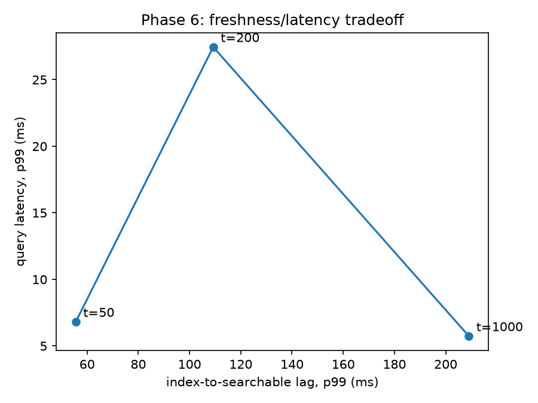
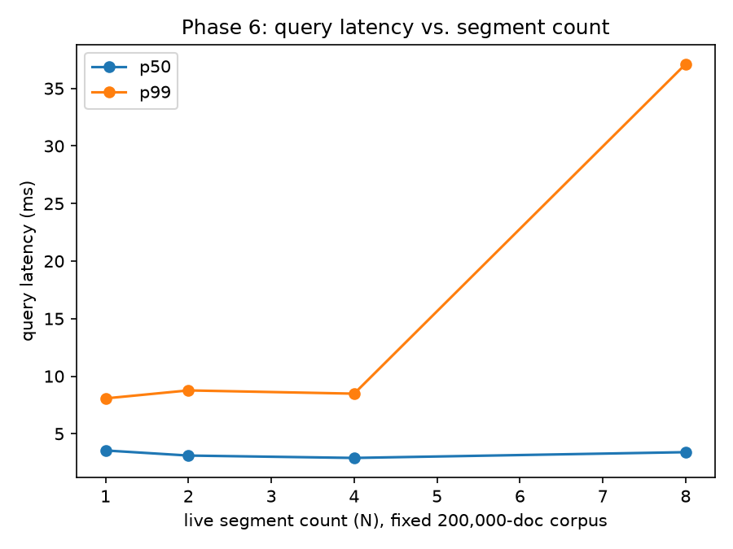

# Phase 6: Near-Real-Time Indexing

## Freshness/latency tradeoff

| flush threshold (docs) | lag p99 (ms) | query p99 (ms) | final segments | collisions skipped |
|---|---|---|---|---|
| 50 | 55.59 | 6.81 | 7 | 4118 |
| 200 | 109.24 | 27.46 | 6 | 4115 |
| 1000 | 209.05 | 5.74 | 2 | 4106 |

Base corpus: 50,000 docs (already indexed). Write stream: 5,000 docs, added one at a time. `merge_factor=4`, `max_segments=8`.

## Segment-count effect (fixed corpus size)

| N | p50 (ms) | p99 (ms) |
|---|---|---|
| 1 | 3.55 | 8.07 |
| 2 | 3.11 | 8.76 |
| 4 | 2.90 | 8.48 |
| 8 | 3.40 | 37.12 |

Fixed corpus: 200,000 docs, partitioned into N segments for each point -- the same corpus-shrinkage-per-segment effect `bench/phase2b.md` disclosed for its shards is still present here. What isolates the fan-out/merge cost specifically is that all N segments live in one process with no network hop and no per-shard worker pool, so the only things that scale with N are Python-level fan-out overhead and the merge/sort/tombstone-filter step, not shard process scheduling or broker-pool sizing. This is a different, valid question from Phase 2B's "does more shards help tail latency," not a claim to have fixed Phase 2B's confound.

## Merge-in-action evidence

At `flush_threshold_docs=50`, a merge fired during the run: segment count went from 8 to 6, consistent with the configured merge policy actually bounding growth.

## Known limitations

- **Merge is re-tokenization, not a postings-level merge.** Every merge rebuilds from source TSV text via the unmodified `build_index` binary; it is not a sorted-run merge over already-built postings (which would require new C++ in `cpp/index/builder.cc`, out of scope here). Merge cost scales with merged segment size the same way a fresh build does.
- **In-process latency is not served latency.** There is no gRPC, no worker pool, no request queueing in this layer -- these numbers are not comparable to `bench/phase2a.md`'s or `bench/phase2b.md`'s served p99s.
- **No NDCG/quality claim for the multi-segment configuration.** Per-segment BM25 statistics mean the multi-segment configuration's relevance is not evaluated here, the same framing `bench/phase2b.md` established for shards.
- **Flush is synchronous and blocks new writes for its duration.** This design does not overlap flush with the next write batch, unlike Lucene's concurrent in-memory segment writer.
- **A concurrent read blocks during flush, not just concurrent writes.** `NrtIndex._flush_locked` holds the index lock for the full synchronous segment build, so `search()` calls issued during a flush block until the flush completes. `_run_merge` avoids this by building outside the lock and only reacquiring for the final segment-list swap; `_flush_locked` does not, because its input is the live, mutable write buffer rather than already-published segments. No experiment in this report exercises concurrent search-during-flush, so this does not affect any number above.
- **The freshness sweep is not a clean single-variable sweep of the auto-flush threshold, because most of the write stream was never added at all.** At every threshold, only about 836-837 of the 5,000 stream docs (`lag_samples`) were ever actually added -- the rest were skipped as duplicate-key collisions (`collisions_skipped`) or timed out waiting for a lag observation (`timed_out`). At `flush_threshold_docs=1000`, only 836 docs were ever added in total, which never reached that point's own 1000-doc auto-flush threshold -- its `final_segment_count=2` result reflects a single bulk flush at end-of-stream, not periodic threshold-triggered flushing.
- **Each freshness point's query benchmark has too few samples (87 requests) for p99 to be a stable statistic.** `LatencyRecorder`'s nearest-rank percentile formula (`rank = max(1, ceil(p/100 * n))`) makes p99 equal to the single maximum observation at this sample size (confirmed: `p99_us == max_us` for all points in this report), so `query p99` in the freshness table above should be read as one noisy draw, not a repeatable tail latency.
- **The tombstone over-fetch bound (`k + len(tombstones)`) is a fixed heuristic**, not a tuned bound against how many tombstones plausibly cluster near the top-k of a single segment.
